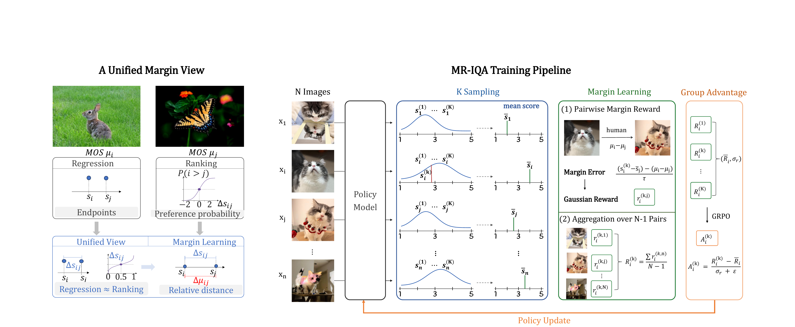

# MR-IQA: A Unified Margin View of Regression and Ranking for Blind Image Quality Assessment

<p align="center">
  <a href="assets/mr_iqa_overview.pdf"></a>
</p>

<p align="center">
  <a href="https://huggingface.co/RobinY99/MR-IQA">Model Weights</a> |
  <a href="assets/mr_iqa_overview.pdf">Overview PDF</a> |
  <a href="reports/released_model_validation_history.md">Validation History</a> |
  <a href="#3-training">Training</a> |
  <a href="#4-evaluation">Evaluation</a> |
  <a href="#citation">Citation</a>
</p>

We derive that regression and ranking are approximately equivalent under a unified margin view. Based on this observation, we propose MR-IQA for margin learning in blind image quality assessment.

## 1. Environment Setup

Create an isolated Python environment before installing project dependencies. The release was smoke-tested with Python 3.12, PyTorch 2.8.0 built for CUDA 12.6, and a CUDA 12.5 toolkit. This CUDA toolkit / PyTorch CUDA build combination is accepted by PyTorch for these scripts.

```bash
conda create -n mr-iqa python=3.12 -y
conda activate mr-iqa
pip install torch==2.8.0 --index-url https://download.pytorch.org/whl/cu126
pip install -r requirements.txt
```

If your cluster manages environments with `venv` instead of conda:

```bash
python -m venv .venv
source .venv/bin/activate
pip install torch==2.8.0 --index-url https://download.pytorch.org/whl/cu126
pip install -r requirements.txt
```

If your machine uses a different CUDA stack, install the matching PyTorch wheel first, then install `requirements.txt`. `CUDA_HOME` is only needed when packages compile CUDA extensions; the launch scripts add `src/` to `PYTHONPATH` automatically.

Optional runtime overrides:

```bash
export CUDA_HOME=<cuda-toolkit-root>
export PYTHON_BIN=python3
export REPORT_TO=none
```

Reference training stack:

```text
Python 3.12
PyTorch 2.8.0 + CUDA 12.6 wheel
CUDA toolkit 12.5
DeepSpeed 0.18.4
Transformers 5.5.0
TRL 1.0.0
Accelerate 1.13.0
PEFT 0.18.1
```

## 2. Data Preparation

Prepare a training manifest in JSON or JSONL format. Each row should contain an image path and a human quality score:

```json
{"image": "000001.png", "score": 3.72, "std": 0.41}
```

Supported score keys include `score`, `mos`, `rating`, `human_score`, `normalized_score`, and `gt_score_norm`. Supported uncertainty keys include `std`, `score_std`, `mos_std`, `source_std`, and `std_norm`.

The committed manifests use relative image paths only. Point `IMAGE_ROOT` or `VAL_IMAGE_ROOT` to the corresponding image directory on your machine or cluster.

Expected layout:

```text
data/
  manifest_checksums.json
  train_manifest/
    train.jsonl
  val_manifests/
    koniq_val_200_seed42.json
  test_manifests/
    agiqa3k.json
    csiq.json
    kadid_full.json
    koniq.json
    livew.json
    pipal.json
    spaq_full.json
    tid2013.json
```

## 3. Training

The launch scripts do not contain local absolute paths. Set the model, manifest, and image-root paths explicitly for each machine.

Run 8-GPU full fine-tuning without validation:

```bash
MODEL_PATH=<hf-model-id-or-local-model-dir> \
DATA_FILES=data/train_manifest/train.jsonl \
IMAGE_ROOT=<train-image-root> \
OUTPUT_DIR=outputs/mr-iqa-2b \
VARIANCE_MODE=unit \
bash scripts/train_mr_iqa_2b_8gpu.sh
```

Run 8-GPU full fine-tuning followed by 8-GPU validation:

```bash
MODEL_PATH=<hf-model-id-or-local-model-dir> \
DATA_FILES=data/train_manifest/train.jsonl \
IMAGE_ROOT=<train-image-root> \
VAL_DATA_FILE=data/val_manifests/koniq_val_200_seed42.json \
VAL_IMAGE_ROOT=<val-image-root> \
OUTPUT_DIR=outputs/mr-iqa-2b \
VAL_OUTPUT_JSON=outputs/mr-iqa-2b/validation/final.json \
VARIANCE_MODE=unit \
bash scripts/train_mr_iqa_2b_8gpu_with_val.sh
```

`VARIANCE_MODE` controls the margin scale:

```text
unit   uses variance scale 1
sigma  uses the paired ground-truth score sigma
```

For a 4B backbone, use:

```bash
bash scripts/train_mr_iqa_4b_8gpu.sh
```

or the validation-enabled wrapper:

```bash
bash scripts/train_mr_iqa_4b_8gpu_with_val.sh
```

## 4. Evaluation

Single-dataset evaluation:

```bash
python src/mr_iqa/evaluate_mr_iqa.py \
  --model_name_or_path <model-or-checkpoint> \
  --data_file data/test_manifests/koniq.json \
  --image_root <image-root> \
  --output_json outputs/eval/koniq.json
```

8-GPU validation-only evaluation:

```bash
MODEL_DIR=<model-or-checkpoint> \
VAL_DATA_FILE=data/val_manifests/koniq_val_200_seed42.json \
IMAGE_ROOT=<image-root> \
OUT_JSON=outputs/validation/koniq_val.json \
bash scripts/validation_eval_8gpu.sh
```

8-GPU generalization evaluation:

```bash
MODEL_DIR=<model-or-checkpoint> \
DATA_DIR=data/test_manifests \
IMAGE_ROOT=<image-root> \
OUT_DIR=outputs/generalization \
bash scripts/generalization_eval_8gpu.sh
```

Override the default generalization set with `DATASETS="koniq spaq_full"` if you only want a subset.

## 5. Repository Layout

```text
configs/      DeepSpeed configuration
data/         Relative-path training, validation, and test manifests
scripts/      2B/4B training and 8-GPU evaluation launchers
src/mr_iqa/   Training, scoring, parsing, and evaluation code
assets/       Project overview PDF and PNG preview
```

## License

This project is released under the MIT License. See `LICENSE` for details.

## Citation

```bibtex
@article{mriqa,
  title={MR-IQA: A Unified Margin View of Regression and Ranking for Blind Image Quality Assessment},
  author={TODO},
  journal={TODO}
}
```
